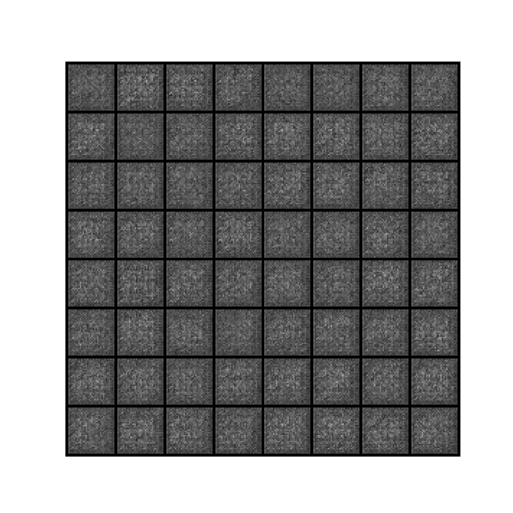

# DCGAN for Handwritten Character Image Generation

A PyTorch implementation of a Deep Convolutional Generative Adversarial Network (DCGAN) that learns to generate 32x32 grayscale handwritten character images from random noise.

## Overview

A GAN consists of two networks trained adversarially:

- The **Generator** maps a latent noise vector to a synthetic image.
- The **Discriminator** estimates whether an image is real or generated.

This implementation uses convolutional layers in the Discriminator and transposed convolutional layers in the Generator. The Generator receives a 100-dimensional latent vector and produces a `1 x 32 x 32` grayscale image. The Discriminator consumes an image of the same shape and returns a real/fake probability.

## Demo / Training Progress

The repository includes a training animation generated from fixed latent vectors. It shows how the Generator's output changes over the saved training checkpoints.



An additional GIF artifact is available at [`generator_progress_x.gif`](generator_progress_x.gif). The training script itself writes a newly generated `generator_progress.gif` when training completes; that runtime output is ignored by Git, so the checked-in demo uses the existing `generator_progress_t.gif` artifact.

## Generated Results

The checked-in sample grid below was produced during training at epoch 100:


The training run also stores loss plots in [`dcgan_results/`](dcgan_results/) and model snapshots in [`training_models/`](training_models/). After a trained Generator has been saved, [`src/generate_images.py`](src/generate_images.py) samples 20 new latent vectors and writes the resulting PNG files to `generated_images/`. That directory is created at runtime and is excluded from version control.

## Architecture

### Generator

The Generator accepts a `100 x 1 x 1` latent tensor and progressively upsamples it to a grayscale `1 x 32 x 32` image.

| Layer | Operation | Output shape | Details |
| --- | --- | --- | --- |
| Input | Latent tensor | `100 x 1 x 1` | Random normal noise |
| 1 | Transposed convolution | `256 x 4 x 4` | Kernel 4, stride 2, no padding; BatchNorm + ReLU |
| 2 | Transposed convolution | `128 x 8 x 8` | Kernel 4, stride 2, padding 1; BatchNorm + ReLU |
| 3 | Transposed convolution | `64 x 16 x 16` | Kernel 4, stride 2, padding 1; BatchNorm + ReLU |
| 4 | Transposed convolution | `1 x 32 x 32` | Kernel 4, stride 2, padding 1; Tanh |

### Discriminator

The Discriminator reduces a `1 x 32 x 32` grayscale image to a scalar probability.

| Layer | Operation | Output shape | Details |
| --- | --- | --- | --- |
| Input | Image tensor | `1 x 32 x 32` | Grayscale image |
| 1 | Convolution | `64 x 16 x 16` | Kernel 4, stride 2, padding 1; BatchNorm + ReLU |
| 2 | Convolution | `128 x 8 x 8` | Kernel 4, stride 2, padding 1; BatchNorm + ReLU |
| 3 | Convolution | `256 x 4 x 4` | Kernel 4, stride 2, padding 1; BatchNorm + ReLU |
| 4 | Convolution | `1 x 1 x 1` | Kernel 4, stride 2, no padding; Sigmoid |

## Training Configuration

The values below are defined in [`src/train.py`](src/train.py).

| Parameter | Value |
| --- | --- |
| Batch size | `32` |
| Image size | `32 x 32` |
| Image channels | `1` (grayscale) |
| Latent vector size | `100` |
| Generator feature size (`ngf`) | `64` |
| Discriminator feature size (`ndf`) | `64` |
| Epochs | `100` |
| Learning rate | `0.0001` |
| Adam beta1 | `0.5` |
| Adam beta2 | `0.999` |
| Loss function | Binary cross-entropy (`BCELoss`) |
| Device selection | CUDA, Apple MPS, or CPU |
| Checkpoint interval | Every `10` epochs |

## Dataset and Preprocessing

The data loader in [`src/utils.py`](src/utils.py) uses `torchvision.datasets.ImageFolder` with `dataset/Train` as its root. The current training subset contains 2,400 JPEG images under the class directory `dataset/Train/15`. The broader EMNIST image collection and label CSV are present under `dataset/EMNIST/`.

Each input image is processed as follows:

1. Convert to grayscale.
2. Resize to `32 x 32` pixels.
3. Convert to a floating-point tensor scaled to `[0, 1]`.
4. Normalize using mean `0.5` and standard deviation `0.5`, producing the `[-1, 1]` range expected by the Generator's Tanh output.

`ImageFolder` expects images to be grouped into one directory per class:

```text
dataset/
├── EMNIST/
│   ├── emnist.csv
│   └── <class-label>/
│       └── *.jpeg
└── Train/
	└── 15/
		└── *.jpeg
```

## Getting Started

Install the runtime dependencies in a virtual environment:

```bash
python -m venv .venv
source .venv/bin/activate       # macOS/Linux
pip install torch torchvision numpy matplotlib Pillow
```

There is no `requirements.txt` in this repository, so dependencies are installed explicitly above.

### Train the model

Run the training script from `src/`; the data loader currently resolves its dataset path relative to that working directory:

```bash
cd src
python train.py
```

Training writes checkpoints to `training_models/`, generated training grids to `training_results/`, loss plots to `dcgan_results/`, and the final animation to the project root.

### Generate new images

After training has produced `training_models/generator_trained.pth`:

```bash
cd src
python generate_images.py
```

The script saves 20 generated images to `generated_images/`.

## Project Structure

```text
.
├── dataset/
│   ├── EMNIST/
│   │   ├── emnist.csv
│   │   └── <class-label>/
│   └── Train/
│       └── 15/
├── dcgan_results/
│   └── DCGAN_losses_epoch_*.png
├── generator_progress_t.gif
├── generator_progress_x.gif
├── src/
│   ├── dcgan.py
│   ├── generate_images.py
│   ├── train.py
│   └── utils.py
├── training_models/
│   ├── discriminator_*.pth
│   ├── generator_*.pth
│   └── generator_trained.pth
├── training_results/
│   └── DCGAN_epoch_*.png
├── .gitignore
└── README.md
```

Generated images, checkpoints, plots, and runtime output are covered by the repository's ignore rules where applicable. The existing artifacts shown above are retained as project outputs for inspection.

